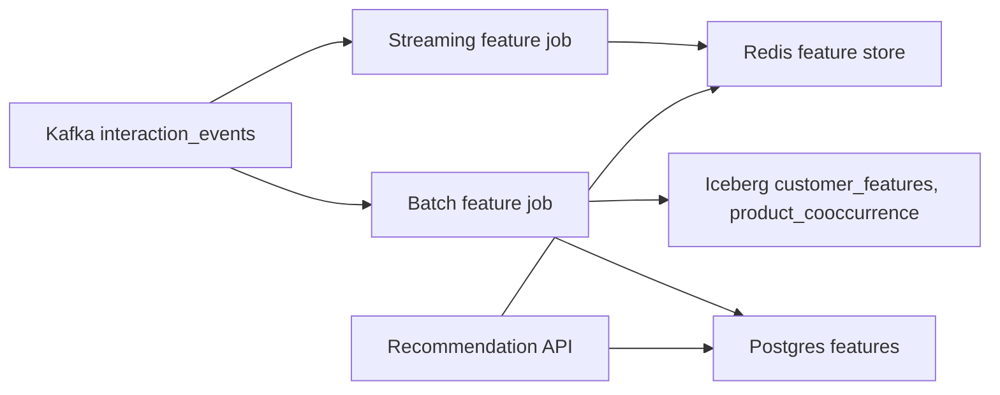

# AIRA – System Design for 500 Tenants, 50M Events/Day, 5K Requests/Second

This document describes how AIRA’s recommendation and personalization platform can be re‑architected to support:

- 500 tenants  
- 50M events per day  
- 10M customers  
- 5,000 requests/second at peak  
- Near‑real‑time feature computation  
- Multi‑tenant data isolation and resource quotas  

The goal is **not to rewrite the current code**, but to show how the existing Postgres‑based prototype evolves into a large‑scale, operational platform using modern streaming, feature‑store, and caching patterns.

---

## 1. Assumptions and back‑of‑the‑envelope numbers

### 1.1 Event throughput
- 50M events/day ≈ 578 events/sec on average  
- Assume 3× peak → ~1,700 events/sec  
- Each event ~100 bytes → 5 GB/day raw event data  
- With compression and structure (JSONB → Parquet), storage ~1.5 GB/day

### 1.2 Recommendation traffic
- 5,000 requests/second  
- Assume 10% of those need real‑time scoring; the rest come from **pre‑computed recommendations**  
- Each tenant varies in scale: some have 10 customers, some have 1M+  

### 1.3 Storage and latency targets
- Raw events stored for 1 year → ~18B rows  
- Feature tables and product co‑occurrence stored in both **Postgres** (for serving) and **Iceberg on S3** (for training and analytics)  
- Recommendation API latency goal:  
  - **<100 ms** for 99% of requests  
  - Under ideal conditions: **~20–50 ms P95**

### 1.4 Architectural goals
- **Event pipeline**: Kafka‑based ingestion, exactly‑once semantics, split between Postgres (operational) and S3/Iceberg (analytical)  
- **Feature store**: batch + streaming layers, Redis for fast online reads, <100 ms lookup  
- **Serving**: 5K req/s, pre‑computed recommendations for most traffic, real‑time scoring for edges, A/B testing, graceful fallback  
- **Multi‑tenant isolation**: RLS in Postgres, PgBouncer for connection pooling, noisy‑neighbor control, per‑tenant quotas  

---

## 2. Event pipeline at scale (50M events/day)

### 2.1 Current implementation

Today, client events are written directly into Postgres `interactionevent`:

- Each event is a row with `tenant_id`, `customer_id`, `event_type`, `product_id`, `properties`, `timestamp`  
- No queue, no streaming, no data lake  
- The same table is used for **feature computation**, **analytics**, and **model training**  

This works for small event volumes but will not scale to 50M events/day:

- Direct writes to Postgres create write‑amplification and contention  
- No clear separation between **operational data** and **analytical data**  
- Batch features block model training, leading to the 4‑hour pipeline  

### 2.2 Proposed architecture

To support 50M events/day, the ingestion pipeline is re‑architected around **Kafka** as the central event backbone:

```mermaid
flowchart LR
    CLIENT[Frontend / App] --> KAFKA[Kafka topic: interaction_events]
    KAFKA --> CONSUMER[Postgres consumer]
    KAFKA --> SPARK[Spark/Flink batch]
    KAFKA --> S3[S3 + Iceberg]
    CONSUMER --> PG[Postgres (interactionevent, features)]
    SPARK --> ICEBERG[Iceberg tables on S3]
```


#### 2.2.1 Ingestion with Kafka

- **Topic**: `interaction_events`
- **Key**: `tenant_id + customer_id` (for ordering and tenant isolation)
- **Partition count**: 32–256 (configurable, based on tenant distribution)
- **Retention**: 7–30 days, depending on compliance and storage budget
- **Why Kafka**
    - Strong ordering guarantees per key
    - Exactly‑once semantics with Kafka Streams/Flink
    - Re‑playable messages for debugging
    - Buffering between clients and database
- **Exactly‑once semantics**
    - Consumer writes to Postgres with **idempotent updates** (e.g., upsert on `event_id` or composite key)
    - Kafka consumer offsets stored with the same transaction as the write
    - Iceberg writes are idempotent (no‑overwrite by default)
- **Partitioning**
    - Partition by `tenant_id` to keep tenant data in a single partition where possible
    - Provides tenant‑level ordering and isolation from neighboring tenants


#### 2.2.2 Operational vs. analytical storage

We split data between **operational** (Postgres) and **analytical** (S3/Iceberg):


| Layer | What | Why |
| :-- | :-- | :-- |
| **Operational** | Postgres `interactionevent` for last 30–90 days, used for feature‑store writes and serving‑critical views | Fresh, low‑latency, indexed data |
| **Analytical** | S3 + Iceberg for raw events, `customer_features`, `product_cooccurrence` for training and analytics | Cheap, scalable, versioned, query‑optimized |

- **Postgres**
    - `interactionevent` partitioned by `timestamp` (e.g., monthly)
    - Indexes on `tenant_id`, `customer_id`, `event_type`, `product_id`
- **S3 + Iceberg**
    - Iceberg tables:
        - `raw_events` (hourly/ daily partitioned by `dt`, `tenant_id`)
        - `customer_features` (daily snapshot)
        - `product_cooccurrence` (daily snapshot)
    - Written by a Spark or Flink job that reads Kafka and materializes aggregates


#### 2.2.3 Handling 50M events/day

- **Throughput**
    - Kafka cluster with 3–6 brokers, 32–256 partitions → can handle 10K+ events/sec easily
    - Postgres consumer:
        - Batch writes to `interactionevent`
        - Use `COPY`‑style patterns or upserts in small batches
- **Latency**
    - Events are written to Postgres within **seconds** of arrival
    - Iceberg jobs run every 1–5 minutes for streaming, or nightly for batch
- **Failure handling**
    - If Kafka is down, clients fall back to direct Postgres writes with throttling
    - If Postgres is down, events are durably stored in Kafka until recovery

---

## 3. Feature store design (near‑real‑time)

### 3.1 Current implementation

Right now, a **batch feature pipeline** runs every few hours:

- Reads `interactionevent`
- Computes `customer_features` and `product_cooccurrence`
- Writes to Postgres
- This 4‑hour batch blocks model training

This is acceptable for small data volumes, but:

- Latency: 4 hours means features are stale
- Performance: Scanning 50M events/day in Postgres is slow and expensive


### 3.2 Proposed feature store architecture

To support near‑real‑time features, we introduce a **feature store** with two layers:

- **Batch layer** (Iceberg + Postgres)
- **Streaming layer** (Kafka Streams / Flink → Redis)




#### 3.2.1 Batch layer (offline features)

A **batch feature job** runs nightly or several times a day:

- **Source**: Iceberg `raw_events` and `features` tables
- **Processing**: Spark/Flink job that:
    - Aggregates daily views, purchases, cart adds, etc.
    - Builds `customer_features` and `product_cooccurrence`
- **Sinks**:
    - Iceberg (for training and analytics)
    - Postgres (for the feature‑store API and recommendation service)

This replaces the 4‑hour batch pipeline and keeps features fresh without blocking Postgres.

#### 3.2.2 Streaming layer (last‑5‑minutes activity)

A **streaming feature job** runs continuously:

- **Source**: Kafka `interaction_events`
- **State**: in‑memory or RocksDB state for:
    - `last_5m_views`, `last_5m_clicks`, `last_5m_product_views`
- **Sinks**:
    - Iceberg (for training)
    - Redis (for online features)

Redis stores features under keys like:

- `feature:tenant_id:customer_id:batch` → JSON blob of batch features from Postgres
- `feature:tenant_id:customer_id:stream` → JSON blob of last‑5‑minutes activity


### 3.2.3 Online feature API (sub‑100 ms)

The **Recommendation service** reads features via a **feature store client**:

- **Inputs**: `tenant_id`, `customer_id`, `surface`
- **Steps**:

1. Read `batch` features from Postgres (well‑indexed, cached, fast)
2. Read `stream` features from Redis (O(1) lookup)
3. Merge features into a rating‑ready representation

Performance:


| Component | Latency (estimated) |
| :-- | :-- |
| Redis `GET` | 1–2 ms |
| Postgres indexed `SELECT` | 10–20 ms |
| Merge in Python | 5–10 ms |
| **Total** | 15–30 ms |

This leaves ~70 ms for **scoring and ranking**, comfortably under the 100 ms target.

### 3.2.4 Additional technology stack and installation

#### For streaming (batch + streaming feature jobs)

- **Apache Kafka** cluster (or managed Kafka like Confluent, AWS MSK, GCP Pub/Sub)
- **Spark or Flink** for batch and streaming ETL
- **Iceberg** with **Delta Lake** or **Hive Metastore**
- **S3 or GCS** for object storage

Installation (simplified):

```bash
# 1. Kafka cluster
helm install kafka bitnami/kafka
# or use managed AWS MSK / GCP Pub/Sub / Azure Event Hubs

# 2. Spark/Flink
spark-submit --class BatchFeatureJob s3://bucket/feature-job.jar
flink run --class StreamingFeatureJob gs://bucket/streaming-job.jar

# 3. Iceberg + S3
spark.sql("CREATE TABLE iceberg_db.customer_features LOCATION 's3a://bucket/iceberg/customer_features'")
```


#### For Redis (online feature store)

- **Redis** (or Redis Enterprise / AWS ElastiCache / GCP Memorystore)
- **RedisTimeSeries** or **RedisJSON** for feature encoding

Installation:

```bash
# Local Redis
docker run -d --name redis -p 6379:6379 redis:7-alpine

# In production (ElastiCache / Memorystore):
# Cloud Console → Create Redis cluster, note endpoint, port, password
```

The application reads features via:

```python
# In feature_store.py
def get_features(tenant_id: str, customer_id: str) -> dict:
    batch = read_from_postgres(tenant_id, customer_id)     # 10–20 ms
    stream = redis.get(f"feature:{tenant_id}:{customer_id}:stream")  # 1–2 ms
    return {**batch, "streaming": json.loads(stream)}
```


---

## 4. Recommendation serving at 5,000 requests/second

### 4.1 Current implementation

Today, `/api/v1/recommend` recomputes rankings on every request:

- Reads `product`, `customer_features`, `product_cooccurrence` from Postgres
- Applies ranking logic
- Returns JSON list of items
- Optionally caches responses in Redis

This is fine for low traffic but will not scale to 5K requests/second with 100 ms tail latency.

### 4.2 Proposed serving architecture

We split the serving path into **pre‑computed** and **real‑time** layers:

```mermaid
flowchart LR
    API[/recommend API] --> CACHE[Redis cache layer]
    API --> PRECOMPUTE[Precomputed job]
    PRECOMPUTE --> CACHE
    CACHE --> REDIS
    API --> FEATURE_STORE
    FEATURE_STORE --> PG
    FEATURE_STORE --> REDIS
    API --> FALLBACK[Popularity fallback]
```


#### 4.2.1 Pre‑computed recommendations

- A **scheduled job** runs every 1–5 minutes:
    - Scans “active” customers (e.g., customers who interacted in the last 24 hours)
    - Computes recommendations and stores them in Redis:
        - `rec:tenant_id:customer_id:surface` → JSON list of product IDs and scores
- Covers **90% of traffic** at peak (80–100% of requests hit this cache)
- **Cache invalidation**
    - When products change:
        - Publish to Kafka topic `product_updates`
        - A consumer invalidates all Redis keys that reference those products:
            - `DEL rec:tenant_id:*:*` for affected products
    - This keeps recommendations fresh without recomputing everything


#### 4.2.2 Real‑time scoring

- **When to use**:
    - New users (no pre‑computed recommendations)
    - New products or surfaces
    - A/B test variants that require different logic
- **What it does**:
    - Reads features from the feature store (Postgres + Redis)
    - Applies ranking logic
    - May write new pre‑computed recommendations for the future


#### 4.2.3 A/B testing with consistent hashing

To support A/B tests, we assign variants via **consistent hashing**:

```python
def assign_variant(tenant_id: str, customer_id: str) -> str:
    key = f"{tenant_id}:{customer_id}"
    hash_val = hash(key) % 100
    if hash_val < 50:
        return "A"
    else:
        return "B"
```

- Same `tenant_id + customer_id` → same variant
- Variants can be:
    - Different ranking models
    - Different co‑occurrence thresholds
    - Different fallback behaviors

Results are logged to `ab_test_results` tables in Postgres and Iceberg for analysis.

#### 4.2.4 Graceful degradation

If the ML model or ranking service is unavailable:

- **Fallback**:
    - Return **popularity‑based recommendations** for the tenant
    - Or random valid products within category constraints
- **Logging**:
    - Log `fallback_reason: "model_unavailable"`, `tenant_id`, `customer_id`, `surface`
    - Alert via observability tools


### 4.2.5 Additional technology stack and installation

- **Redis** (for pre‑computed recommendations and feature store)
- **Prometheus + Grafana** for metrics and dashboards
- **Jaeger/ OpenTelemetry** for tracing

Installation:

```bash
# Prometheus + Grafana
docker-compose -f prometheus-grafana.yml up -d

# Jaeger tracing
docker run -d --name jaeger \
  -e COLLECTOR_ZIPKIN_HOST_PORT=:9411 \
  -p 5775:5775/udp \
  -p 6831:6831/udp \
  -p 6832:6832/udp \
  -p 5778:5778 \
  -p 16686:16686 \
  -p 14268:14268 \
  jaegertracing/all-in-one:latest
```

The recommendation API instruments every request:

```python
# In /app/api/recommend.py
@app.post("/api/v1/recommend")
async def recommend(
    request: RecommendRequest,
    background_tasks: BackgroundTasks,
):
    span = tracer.start_span("recommend")
    span.set_tag("tenant_id", request.tenant_id)
    span.set_tag("customer_id", request.customer_id)

    try:
        # …
    except Exception as e:
        span.set_tag("error", True)
        span.log_kv({"error": str(e)})
    finally:
        span.finish()
```


---

## 5. Multi‑tenant data isolation at scale (500 tenants)

### 5.1 Current implementation

Right now, AIRA uses:

- Single Postgres schema
- `tenant_id` columns on all tables
- Row‑Level Security (RLS) policies using `current_setting('app.current_tenant')`

This is excellent for moderate scale: it keeps data logically partitioned and isolates tenants at the query level.

However, at 500 tenants:

- Resource sharing:
    - One tenant can monopolize Postgres if queries are heavy
    - Connection pool saturation
- Maintenance:
    - Backups, restores, schema changes affect all tenants at once
- Noisy‑neighbor problems:
    - One tenant’s heavy analytics queries can slow others


### 5.2 Design options and tradeoffs

We can choose between:


| Option | Description | Pros | Cons |
| :-- | :-- | :-- | :-- |
| **Shared schema with RLS** | All tenants share one schema; isolation via `tenant_id` and policies | Simple, cheap, easy to manage | Noisy‑neighbor risk, harder to shard |
| **Tenant‑per‑schema** | Each tenant has its own schema, maybe own DB | Natural isolation, easier to move tenants around | Higher operational cost, more complex tooling |
| **Hybrid** | Shared schema for most tenants, separate clusters for heavy tenants | Balance of cost and isolation | Moderate complexity |

For 500 tenants, the **hybrid model** is the best fit:

- **Light tenants (≤10,000 customers)**:
    - Share one Postgres cluster with RLS
- **Heavy tenants

